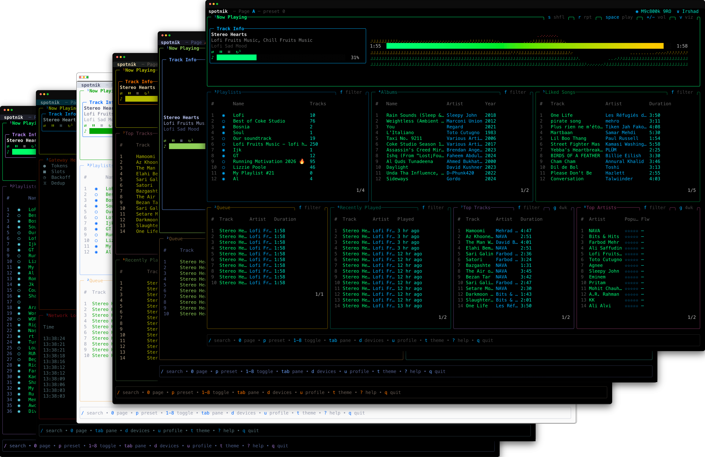

[](https://github.com/initgrep-apps/spotnik/actions/workflows/ci.yml)
[](https://github.com/initgrep-apps/spotnik/releases/latest)
[](go.mod)
[](LICENSE)

# Spotnik

A terminal client for Spotify.

> Spotnik controls playback on your Spotify Connect devices. It does not play
> audio itself.
>
> *Spotify Premium is required for playback control. See the
> [Spotify Web API docs](https://developer.spotify.com/documentation/web-api/reference/pause-a-users-playback).*




## Install

### macOS and Linux

Latest stable release:

```bash
curl -fsSL https://raw.githubusercontent.com/initgrep-apps/spotnik/main/install.sh | bash
```

Pin a specific version:

```bash
curl -fsSL https://raw.githubusercontent.com/initgrep-apps/spotnik/main/install.sh | SPOTNIK_VERSION=v0.1.0 bash
```

After install, open a new terminal — or run `. ~/.config/spotnik/env` to use
`spotnik` immediately in the current shell.

### Windows

Latest stable release:

```powershell
irm https://raw.githubusercontent.com/initgrep-apps/spotnik/main/install.ps1 | iex
```

Pin a specific version:

```powershell
$env:SPOTNIK_VERSION="v0.1.0"; irm https://raw.githubusercontent.com/initgrep-apps/spotnik/main/install.ps1 | iex
```

The installer updates your user PATH and current PowerShell session.

### Other

DEB and RPM packages, plus pre-built binaries, are on the
[Releases page](https://github.com/initgrep-apps/spotnik/releases/latest). You
can also install from source:

```bash
go install github.com/initgrep-apps/spotnik@latest
```

## Uninstall

The uninstaller wipes tokens from the OS keychain (via `spotnik auth forget`),
removes the binary, removes the env file at `~/.config/spotnik/env` plus any
installer-managed lines from `~/.bashrc`, `~/.zshrc`, `~/.bash_profile`,
`~/.profile`, and `~/.config/fish/conf.d/spotnik.fish`, and prompts before
deleting `~/.config/spotnik`.

### macOS and Linux

```bash
curl -fsSL https://raw.githubusercontent.com/initgrep-apps/spotnik/main/uninstall.sh | bash
```

Skip the prompt — also delete config:

```bash
SPOTNIK_PURGE_CONFIG=1 curl -fsSL https://raw.githubusercontent.com/initgrep-apps/spotnik/main/uninstall.sh | bash
```

Skip the prompt — keep config:

```bash
SPOTNIK_KEEP_CONFIG=1 curl -fsSL https://raw.githubusercontent.com/initgrep-apps/spotnik/main/uninstall.sh | bash
```

### Windows

```powershell
irm https://raw.githubusercontent.com/initgrep-apps/spotnik/main/uninstall.ps1 | iex
```

### Manual

```bash
spotnik auth forget                              # wipe keychain + client ID
sudo rm "$(command -v spotnik)"                  # remove binary
rm -f ~/.config/spotnik/env                      # remove env file
rm -rf ~/.config/spotnik                         # remove config (optional)
# Strip the marker block from any rc files manually if needed.
```


## Setup

Spotify Premium is required (the Web API only allows playback control on
Premium accounts).

A Spotify Developer app is needed for the PKCE OAuth flow:

1. Visit [developer.spotify.com/dashboard](https://developer.spotify.com/dashboard) and create an app.
2. Add `http://127.0.0.1:8888/callback` as a redirect URI.
3. Run `spotnik`. It bootstraps `~/.config/spotnik/config.toml` and prompts for the Client ID.
4. Your browser opens for authorization. Tokens land in the OS keychain.

Spotnik requests 14 Spotify OAuth scopes. See [docs/SCOPES.md](docs/SCOPES.md)
for the full list and revocation steps.

## Features

Spotnik organises the TUI into two pages with a btop-style, pane-based layout.
Page A holds the everyday Spotify panes; Page B is a live developer view of the
API gateway.

### How to use

* Press `0` to switch between Page A and Page B.
* Press `1` through `8` to toggle individual panes. Each pane title shows a
  small superscript number indicating its toggle key.
* Press `Tab` (or `Shift+Tab`) to move focus between visible panes.
* Use `↑`/`↓` (or `j`/`k`, or the mouse wheel) to scroll list panes.
* Press `Enter` in a list pane to play the highlighted item.
* Press `f` to filter a list pane, and `Esc` to close any overlay or clear a
  filter.
* Playback keys (`Space`, `←`, `→`, `+`, `-`, `s`, `r`, `v`) work from any pane.

See [Keybindings](#keybindings) for the full reference.

### Page A: Spotify

* **Now Playing**: current track, braille visualizer, gradient seek bar, and volume bar.
* **Queue**: upcoming tracks.
* **Playlists**: your saved playlists.
* **Albums**: your saved albums.
* **Liked Songs**: your liked tracks.
* **Recently Played**: listening history.
* **Top Tracks**: your top tracks.
* **Top Artists**: your top artists.

### Overlays and global

* **Search**: full-screen search across tracks, artists, albums, and playlists, with prefix autocomplete and paginated results.
* **Devices**: transfer playback to any Spotify Connect device.
* **Profile**: user profile, logout, and forget.
* **Themes**: 11 built-in themes with a runtime switcher.
* **Transport**: play, pause, skip, shuffle, repeat, and volume. Always active.
* **Layouts**: preset cycling (`p`) and per-pane visibility toggles (`1`–`8`).
* **Filter**: universal filter on list panes (`f`, `Esc` clears).

### CLI

* **Auth**: `spotnik auth {register, login, logout, forget, status}`.
* **PKCE OAuth**: no client secret required. Tokens are stored in the OS keychain.

### Page B: Developer

Live observability for the underlying API gateway.

* **Gateway Health**: token bucket, backoff, and rate-limit state.
* **Polling Traffic**: per-pane request volume.
* **Live Request Flow**: in-flight requests.
* **Network Log**: recent API events.

The gateway itself handles rate limiting, request dedup, adaptive polling, and
automatic retry-after.

## Keybindings

### Global

| Key | Action |
|-----|--------|
| `/` | Search overlay |
| `d` | Device switcher |
| `u` | User profile overlay |
| `t` | Theme switcher |
| `?` | Help overlay |
| `q` | Quit |
| `0` | Toggle Page A / Page B |
| `1`–`8` | Toggle pane visibility (Page A) |
| `1`–`5` | Toggle pane visibility (Page B) |
| `p` | Cycle preset layout |

### Playback (always active)

| Key | Action |
|-----|--------|
| `Space` | Play / pause |
| `←` / `→` | Previous / next |
| `+` / `-` | Volume |
| `s` | Toggle shuffle |
| `r` | Cycle repeat |
| `v` | Cycle visualizer pattern |

### Navigation

| Key | Action |
|-----|--------|
| `Tab` / `Shift+Tab` | Cycle focus |
| `↑` `↓` `j` `k` | Scroll |
| Mouse wheel | Scroll the pane under the cursor |
| `Esc` | Close overlay, clear filter, or scroll to top |

### Pane actions

| Key | Action | Context |
|-----|--------|---------|
| `Enter` | Select or play | Focused pane |
| `f` | Toggle filter | List panes |
| `g` | Cycle time range | TopTracks, TopArtists |
| `A` | Add to queue | Search, list panes |

### Profile overlay

| Key | Action |
|-----|--------|
| `l` | Logout. Press twice to confirm. Keeps the Client ID. |
| `f` | Forget. Press twice to confirm. Also removes the Client ID. |

### Search overlay

| Key | Action |
|-----|--------|
| `Tab` / `Shift+Tab` | Cycle category |
| `Enter` | Play result |
| `Ctrl+A` | Add to queue |
| `Ctrl+U` | Clear input |
| `PgDn` / `PgUp` | Page results |
| `Esc` | Close |


## Configuration

Spotnik bootstraps `~/.config/spotnik/config.toml` on first launch. Full schema
with defaults:

```toml
# Spotnik configuration
# https://github.com/initgrep-apps/spotnik

[spotify]
# To use your own Spotify app credentials, uncomment and set:
# client_id = "your-client-id-from-spotify-developer-dashboard"

[preferences]
theme = "black"
# preset = 0          # Page A layout preset index (0-based)
# visualizer = 0      # Visualizer pattern index (0-6)

[cli]
# CLI palette: "auto" (default), "fixed", or "theme"
# - auto:  theme colours on dark-bg terminals, fixed elsewhere
# - fixed: always the built-in Spotnik palette
# - theme: inherit the TUI theme (may be unreadable on light terminals)
palette = "auto"

[ui]
# Glyph rendering mode: "auto" (default), "unicode", or "ascii"
# - auto:    use unicode glyphs when LC_ALL/LANG contains UTF-8, else ASCII
# - unicode: always use unicode glyphs (requires a UTF-8 capable terminal)
# - ascii:   always use ASCII fallback glyphs (safe for all terminals)
glyphs = "auto"
```

Available themes: `black` (default), `monokai`, `catppuccin`, `nord`, `light`,
`dracula`, `gruvbox`, `rosepine`, `solarized`, `synthwave`, `tokyonight`.


## Development

Requires **Go 1.26+** and **golangci-lint**.

```bash
git clone https://github.com/initgrep-apps/spotnik.git
cd spotnik
make ci          # fmt-check, tidy-check, lint, test-coverage (>=80%), build
make run         # build and run
```

Other targets: `build`, `test`, `test-integration`, `test-coverage`, `lint`,
`fmt`, `tidy-check`, `clean`, `install`, `release`.

Architecture and system docs live in [docs/system/](docs/system/):
`architecture.md`, `design.md`, `tui.md`, `cli.md`, and `api-guide.md`.

### Tech stack

| Layer | Library |
|-------|---------|
| Language | [Go 1.26+](https://go.dev) |
| TUI runtime | [Bubble Tea](https://github.com/charmbracelet/bubbletea) |
| Components | [Bubbles](https://github.com/charmbracelet/bubbles) |
| Styling | [Lip Gloss](https://github.com/charmbracelet/lipgloss) |
| Tables | [bubble-table](https://github.com/Evertras/bubble-table) |
| Overlays | [bubbletea-overlay](https://github.com/rmhubbert/bubbletea-overlay) |
| Config | [BurntSushi/toml](https://github.com/BurntSushi/toml) |
| Keychain | [zalando/go-keyring](https://github.com/zalando/go-keyring) |
| CLI | [spf13/cobra](https://github.com/spf13/cobra) |
| HTTP | Go stdlib `net/http` |
| Testing | `testing` + [testify](https://github.com/stretchr/testify) |
| Release | [GoReleaser](https://goreleaser.com) + [release-please](https://github.com/googleapis/release-please) |


## License

MIT. See [LICENSE](LICENSE).
